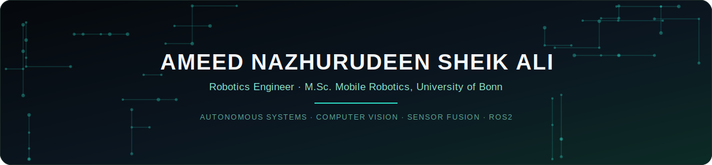

  

  

<a href="https://ameednaz.base44.app">🌐&nbsp;Portfolio</a>&nbsp;&nbsp;·&nbsp;&nbsp;<a href="https://www.linkedin.com/in/ameed-nazhurudeen-a6b4611b3">💼&nbsp;LinkedIn</a>&nbsp;&nbsp;·&nbsp;&nbsp;<a href="mailto:Ameednazhurudeen2002@gmail.com">📧&nbsp;Email</a>&nbsp;&nbsp;·&nbsp;&nbsp;📍&nbsp;Bonn, Germany

 

 

## About

I build autonomous robotic systems for environments where GPS fails and data is messy — underwater, in the field, or on a factory floor. Most of my work sits at the intersection of perception and control: fusing LiDAR, IMU, and depth data into something a robot can actually navigate by, then wrapping AI-based perception around it to make sense of what it sees.

I led R&D on **SEER** and **MARVIS**, two autonomous underwater ROVs built for coral reef monitoring in GPS-denied waters — covering everything from embedded control and SLAM to field deployment and the resulting peer-reviewed write-ups. Before that, I spent time on the industrial side integrating cobots and AMRs into live production lines, which is where I learned that a robot that works in simulation and a robot that works on a factory floor are two very different problems.

I'm now doing my M.Sc. in Mobile Robotics at the University of Bonn, going deeper into the research side of autonomy while staying close to hardware.

 

## Now

- 🎓 M.Sc. Mobile Robotics @ Rheinische Friedrich-Wilhelms-Universität Bonn
- 🔭 Exploring sensor fusion and learning-based perception for GPS-denied navigation
- 🌊 Co-authoring research on lightweight composite structures and stability analysis for underwater ROVs
- 🟢 Open to Werkstudent / research-assistant roles in robotics, AI, and autonomous systems

 

## Core Competencies

 

## Tech Stack

**Languages & Tools**

**Robotics & Autonomy**

**Design & Simulation**

 

## Live GitHub Dashboard

 

  

  

 

## Featured Projects

| Project | Description |
|---|---|
| **[Ameed ROV Project]([https://github.com/AmeedNazhurudeen/habit-rpg-tracker](https://github.com/AmeedNazhurudeen/AmeedROV.git))**  |A complete journey of designing and developing a Semi-Autonomous, Multi-Functional Underwater ROV integrating SLAM, DVL, Sonar, and Machine Learning for Underwater Monitoring. This repository contains designs, code, datasets, and documentation from 2022 to 2025. |
| **[AFPS — Agri Flood Proofing System]([[https://github.com/AmeedNazhurudeen/ROS2-Projects-](https://github.com/AmeedNazhurudeen/Agri-Flood-Proofing-System---AFPS.git)](https://github.com/AmeedNazhurudeen/Agri-Flood-Proofing-System---AFPS.git))**  | IoT + AI flood protection for agricultural land. Detects rising water levels, predicts flood risk with Machine Learning, and automatically activates drainage pumps — all monitored from a web dashboard on any phone or laptop.|
| **[ Cobra Arm](** ) | A ROS 2 simulation where a robot arm uses a camera to find objects on a table and pick them up based on a text command. Fully simulated — no real robot needed. |
| **[ARTIMES]([https://github.com/AmeedNazhurudeen/ResumeOS](https://github.com/AmeedNazhurudeen/ArtimesDrone.git))**  | A ROS 2 drone that doesn't just navigate — it understands its environment.
Multi-modal sensor fusion (Camera + LiDAR + IMU) powers adaptive surveillance patrol with real-time anomaly detection. |
| **[VisionNav]([https://github.com/AmeedNazhurudeen/Samad-RSP-Assignment)** ) |A fully simulated autonomous mobile robot that adapts its navigation decisions in real time based on what its camera sees — built on ROS 2 Humble, Gazebo, Nav2, SLAM Toolbox, and OpenCV. |
| **[MoRo Plant Phenotyping]([[https://github.com/AmeedNazhurudeen/habit-rpg-tracker](https://github.com/AmeedNazhurudeen/AmeedROV.git)](https://github.com/AmeedNazhurudeen/Moro-research-Project.git))**  |The goal is to build a complete automated pipeline that converts raw 3D agricultural scan data into interpretable plant and leaf-level traits such as structure, geometry, and orientation. |

→ More detail, photos, and write-ups for SEER and MARVIS on the [portfolio site](https://ameednaz.base44.app/Projects).

 

## Selected Recognition

- 🥇 **Technoxian World Robotics Championship 9.0** (2025) — 1st place, Innovation category, for a semi-autonomous underwater ROV for coral reef monitoring
- 🏅 **Aegis Graham Bell Award** (2023) — Ministry of Electronics & IT, India, for AI/SLAM-integrated underwater robotics
- 🏅 **5G Hackathon** (2023) - Recognition for the development of an autonomous ROV with 5G-based real-time control and data transmission
- 📄 Design patent, autonomous underwater ROV (2024) · paper in *Taylor & Francis* (Sept 2025, DOI: [10.1080/30654327.2025.2549246](https://doi.org/10.1080/30654327.2025.2549246))

→ Full list of awards and publications on the [portfolio site](https://ameednaz.base44.app/Achievements).

 

## Education & Certifications

| | |
|---|---|
| **M.Sc. Mobile Robotics** | University of Bonn, Germany · 2025 – expected 2027 |
| **B.Eng. Mechatronics** | Agni College of Technology, India · 2020 – 2024 · CGPA 8.02/10 |
| **Certifications** | Advanced Robotics (ROS2, AI/ML, CV) — The Construct · Industrial Robotics (ABB, FANUC, UR, AUBO, MiR, BlueROV) · Mechanical CAD Diploma · Industrial Automation (PLC) |

 

## Languages & Availability

**Languages:** English (fluent) · Tamil (native) · German (basic)
**Availability:** Immediately available, part-time alongside studies

 

*Let's talk robotics — reach out via [email](mailto:Ameednazhurudeen2002@gmail.com) or [LinkedIn](https://www.linkedin.com/in/ameed-nazhurudeen-a6b4611b3).*

