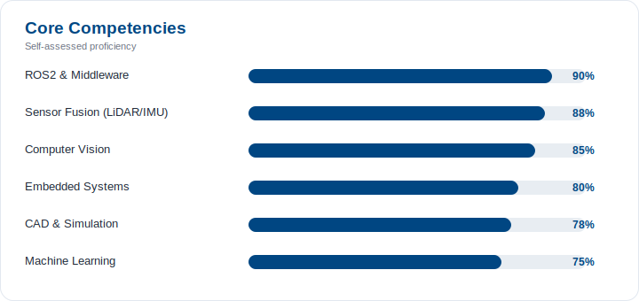

# Ameed Nazhurudeen Sheik Ali
### Robotics Engineer · M.Sc. Mobile Robotics, University of Bonn

Autonomous systems · Computer Vision · Sensor Fusion · ROS2

[Portfolio](https://ameednaz.base44.app) · [LinkedIn](https://www.linkedin.com/in/ameed-nazhurudeen-a6b4611b3) · [Email](mailto:Ameednazhurudeen2002@gmail.com) · Bonn, Germany

 

## About

I build autonomous robotic systems for environments where GPS fails and data is messy — underwater, in the field, or on a factory floor. Most of my work sits at the intersection of perception and control: fusing LiDAR, IMU, and depth data into something a robot can actually navigate by, then wrapping AI-based perception around it to make sense of what it sees.

I led R&D on **SEER** and **MARVIS**, two autonomous underwater ROVs built for coral reef monitoring in GPS-denied waters — covering everything from embedded control and SLAM to field deployment and the resulting peer-reviewed write-ups. Before that, I spent time on the industrial side integrating cobots and AMRs into live production lines, which is where I learned that a robot that works in simulation and a robot that works on a factory floor are two very different problems.

I'm now doing my M.Sc. in Mobile Robotics at the University of Bonn, going deeper into the research side of autonomy while staying close to hardware.

 

## Impact in Numbers

| 2 | 3 | 5 | +25% | 2 |
|:---:|:---:|:---:|:---:|:---:|
| Autonomous ROVs led | Publications | Awards & recognitions | Localization accuracy gain via sensor fusion | Design patents filed |

 

## Core Competencies

 

## Now

- 🎓 M.Sc. Mobile Robotics @ Rheinische Friedrich-Wilhelms-Universität Bonn
- 🔭 Exploring sensor fusion and learning-based perception for GPS-denied navigation
- 🌊 Co-authoring research on lightweight composite structures and stability analysis for underwater ROVs
- 🟢 Open to Werkstudent / research-assistant roles in robotics, AI, and autonomous systems

 

## Tech Stack

**Languages & Tools**

**Robotics & Autonomy**

**Design & Simulation**

*SLAM · Multi-Sensor Fusion (LiDAR / IMU / Depth) · Navigation Stack · Embedded Control · RoboDK*

 

<picture>
  <source media="(prefers-color-scheme: dark)" srcset="https://github-readme-stats.vercel.app/api/top-langs/?username=AmeedNazhurudeen&layout=compact&hide_border=true&title_color=4FA8E0&text_color=c9d1d9&bg_color=0d1117">
  
</picture>

 

## Featured Projects

| Project | Description |
|---|---|
| **[ROS2-Projects-](https://github.com/AmeedNazhurudeen/ROS2-Projects-)**  | A comprehensive ROS2 robotics portfolio — autonomous navigation, SLAM, industrial manipulation, computer vision, underwater ROV systems, and drone control. |
| **[Mazesolver](https://github.com/AmeedNazhurudeen/Mazesolver)**  | Autonomous micromouse maze solver combining flood-fill pathfinding, sensor fusion, and PID control. |
| **[Ameed_plant_phenotyping](https://github.com/AmeedNazhurudeen/Ameed_plant_phenotyping)**  | Computer vision pipeline for automated plant phenotyping. *(add a one-line description in the repo for extra context)* |
| **[ResumeOS](https://github.com/AmeedNazhurudeen/ResumeOS)**  | *(add a one-line description — what does this project do?)* |
| **[Samad-RSP-Assignment](https://github.com/AmeedNazhurudeen/Samad-RSP-Assignment)**  | *(add a one-line description)* |
| **[habit-rpg-tracker](https://github.com/AmeedNazhurudeen/habit-rpg-tracker)**  | *(add a one-line description)* |

→ More detail, photos, and write-ups for SEER and MARVIS on the [portfolio site](https://ameednaz.base44.app/Projects).

 

## GitHub Activity

<picture>
  <source media="(prefers-color-scheme: dark)" srcset="https://github-readme-stats.vercel.app/api?username=AmeedNazhurudeen&show_icons=true&hide_border=true&title_color=4FA8E0&icon_color=4FA8E0&text_color=c9d1d9&bg_color=0d1117&count_private=true">
  
</picture>

 

## Selected Recognition

- 🥇 **Technoxian World Robotics Championship 9.0** (2025) — 1st place, Innovation category, for a semi-autonomous underwater ROV for coral reef monitoring
- 🏅 **Aegis Graham Bell Award** (2023) — Ministry of Electronics & IT, India, for AI/SLAM-integrated underwater robotics
- 📄 Design patent, autonomous underwater ROV (2024) · paper in *Taylor & Francis* (Sept 2025, DOI: [10.1080/30654327.2025.2549246](https://doi.org/10.1080/30654327.2025.2549246))

→ Full list of awards and publications on the [portfolio site](https://ameednaz.base44.app/Achievements).

 

## Education & Certifications

| | |
|---|---|
| **M.Sc. Mobile Robotics** | University of Bonn, Germany · 2025 – expected 2027 |
| **B.Eng. Mechatronics** | Agni College of Technology, India · 2020 – 2024 · CGPA 8.02/10 |
| **Certifications** | Advanced Robotics (ROS2, AI/ML, CV) — The Construct · Industrial Robotics (ABB, FANUC, UR, AUBO, MiR, BlueROV) · Mechanical CAD Diploma · Industrial Automation (PLC) |

 

## Languages & Availability

**Languages:** English (fluent) · Tamil (native) · German (basic)
**Availability:** Immediately available, part-time alongside studies

 

*Let's talk robotics — reach out via [email](mailto:Ameednazhurudeen2002@gmail.com) or [LinkedIn](https://www.linkedin.com/in/ameed-nazhurudeen-a6b4611b3).*

